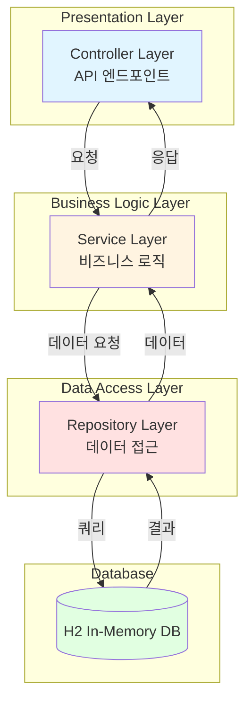
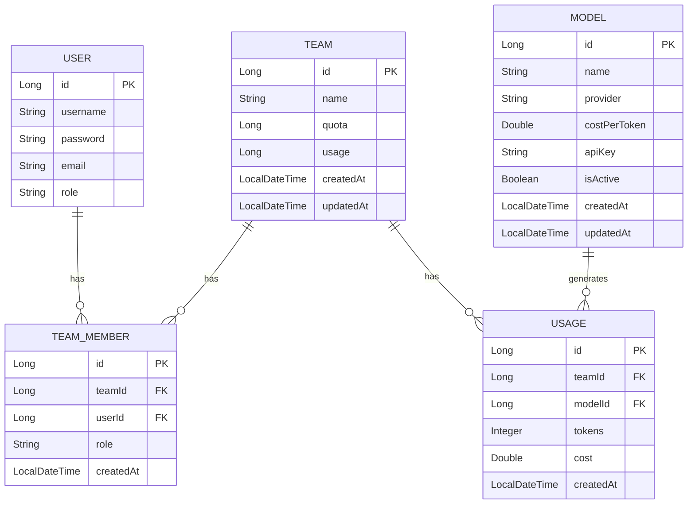

# 백엔드 모듈 아키텍처

## 1. 개요

### 1.1 백엔드 시스템 개요

- **담당자:** 백엔드 개발자 (1명)
- **개발 기간:** 5일 (0.5 M/M)
- **아키텍처 패턴:** Monolithic (3-Layered Architecture)
- **데이터베이스:** H2 In-Memory DB
- **API 스타일:** RESTful API

### 1.2 아키텍처 원칙

- **단순성:** MVP 범위에 맞춰 복잡도 최소화
- **표준화:** Spring Boot 표준 패턴 준수
- **모듈화:** 계층별 명확한 분리
- **테스트 용이성:** 단위 테스트 지원 구조

---

## 2. 계층형 아키텍처 (3-Layered Architecture)



---

## 3. 패키지 구조

### 3.1 전체 패키지 구조

```
com.example.llm
├── controller/           # Presentation Layer
├── service/              # Business Logic Layer
├── repository/           # Data Access Layer
├── entity/               # Domain Model
├── dto/                  # Data Transfer Objects
├── config/               # Configuration
├── exception/            # Custom Exceptions
└── util/                 # Utilities
```

### 3.2 상세 패키지 구조

```
src/main/java/com/example/llm/
├── controller/
│   ├── AuthController.java
│   ├── TeamController.java
│   ├── TeamMemberController.java
│   ├── ModelController.java
│   └── DashboardController.java
├── service/
│   ├── AuthService.java
│   ├── TeamService.java
│   ├── ModelService.java
│   └── DashboardService.java
├── repository/
│   ├── UserRepository.java
│   ├── TeamRepository.java
│   ├── TeamMemberRepository.java
│   ├── ModelRepository.java
│   └── UsageRepository.java
├── entity/
│   ├── User.java
│   ├── Team.java
│   ├── TeamMember.java
│   ├── LLMModel.java
│   └── Usage.java
├── dto/
│   ├── request/
│   │   ├── LoginRequest.java
│   │   ├── TeamCreateRequest.java
│   │   ├── TeamUpdateRequest.java
│   │   ├── ModelCreateRequest.java
│   │   └── QuotaSetRequest.java
│   └── response/
│       ├── LoginResponse.java
│       ├── TeamResponse.java
│       ├── ModelResponse.java
│       └── DashboardResponse.java
├── config/
│   ├── SwaggerConfig.java
│   └── SecurityConfig.java
├── exception/
│   ├── BusinessException.java
│   ├── ResourceNotFoundException.java
│   └── UnauthorizedException.java
└── util/
    └── TokenUtil.java
```

---

## 4. 컨트롤러 레이어 (Presentation Layer)

### 4.1 역할 및 책임

- HTTP 요청 수신 및 응답
- 요청 데이터 검증 (DTO 변환)
- 서비스 레이어 호출
- 예외 처리 및 HTTP 상태 코드 설정

### 4.2 컨트롤러 목록

| 컨트롤러 | 경로 | 주요 기능 |
|---------|------|----------|
| [`AuthController`](architect/backend-architecture.md) | `/api/auth` | 로그인, 로그아웃, 토큰 검증 |
| [`TeamController`](architect/backend-architecture.md) | `/api/teams` | 팀 CRUD, 할당량 설정 |
| [`TeamMemberController`](architect/backend-architecture.md) | `/api/teams/{teamId}/members` | 팀원 관리 |
| [`ModelController`](architect/backend-architecture.md) | `/api/models` | 모델 CRUD, 활성/비활성 |
| [`DashboardController`](architect/backend-architecture.md) | `/api/dashboard` | 대시보드 데이터 조회 |

### 4.3 컨트롤러 예시

#### AuthController

```java
@RestController
@RequestMapping("/api/auth")
@Tag(name = "인증", description = "인증 관련 API")
public class AuthController {
    
    private final AuthService authService;
    
    @PostMapping("/login")
    @Operation(summary = "로그인", description = "사용자 로그인 (Mock)")
    public ResponseEntity<LoginResponse> login(@RequestBody LoginRequest request) {
        LoginResponse response = authService.login(request);
        return ResponseEntity.ok(response);
    }
}
```

---

## 5. 서비스 레이어 (Business Logic Layer)

### 5.1 역할 및 책임

- 비즈니스 로직 구현
- 트랜잭션 관리
- 데이터 변환 및 가공
- 예외 발생 및 처리

### 5.2 서비스 목록

| 서비스 | 주요 기능 |
|--------|----------|
| [`AuthService`](architect/backend-architecture.md) | 로그인, 토큰 발급 및 검증 |
| [`TeamService`](architect/backend-architecture.md) | 팀 생성, 조회, 수정, 삭제 |
| [`ModelService`](architect/backend-architecture.md) | 모델 등록, 조회, 수정, 삭제 |
| [`DashboardService`](architect/backend-architecture.md) | 대시보드 데이터 집계 |

### 5.3 서비스 예시

#### TeamService

```java
@Service
@Transactional
public class TeamService {
    
    private final TeamRepository teamRepository;
    private final TeamMemberRepository teamMemberRepository;
    
    public Team createTeam(TeamCreateRequest request) {
        Team team = Team.builder()
            .name(request.getName())
            .quota(request.getQuota())
            .build();
        return teamRepository.save(team);
    }
    
    @Transactional(readOnly = true)
    public List<Team> getAllTeams() {
        return teamRepository.findAll();
    }
}
```

---

## 6. 리포지토리 레이어 (Data Access Layer)

### 6.1 역할 및 책임

- 데이터베이스 CRUD 작업
- JPA 엔티티 매핑
- 데이터베이스 쿼리 실행

### 6.2 리포지토리 목록

| 리포지토리 | 엔티티 | 주요 메소드 |
|-----------|--------|-----------|
| [`UserRepository`](architect/backend-architecture.md) | User | findByUsername, findAll |
| [`TeamRepository`](architect/backend-architecture.md) | Team | findAll, findById, save, delete |
| [`TeamMemberRepository`](architect/backend-architecture.md) | TeamMember | findByTeamId, save, delete |
| [`ModelRepository`](architect/backend-architecture.md) | LLMModel | findAll, findById, save, delete |
| [`UsageRepository`](architect/backend-architecture.md) | Usage | findByTeamId, findByDate |

### 6.3 리포지토리 예시

#### TeamRepository

```java
@Repository
public interface TeamRepository extends JpaRepository<Team, Long> {
    
    List<Team> findByNameContaining(String name);
    
    @Query("SELECT t FROM Team t WHERE t.quota > t.usage")
    List<Team> findTeamsWithAvailableQuota();
}
```

---

## 7. 엔티티 모델 (Entity Layer)

### 7.1 엔티티 ERD



### 7.2 엔티티 상세

#### User 엔티티

```java
@Entity
@Table(name = "users")
@Getter
@Setter
@Builder
@NoArgsConstructor
@AllArgsConstructor
public class User {
    
    @Id
    @GeneratedValue(strategy = GenerationType.IDENTITY)
    private Long id;
    
    @Column(unique = true, nullable = false)
    private String username;
    
    @Column(nullable = false)
    private String password;
    
    @Column(unique = true, nullable = false)
    private String email;
    
    @Column(nullable = false)
    private String role;
    
    @Column(nullable = false, updatable = false)
    private LocalDateTime createdAt;
    
    @PrePersist
    protected void onCreate() {
        createdAt = LocalDateTime.now();
    }
}
```

#### Team 엔티티

```java
@Entity
@Table(name = "teams")
@Getter
@Setter
@Builder
@NoArgsConstructor
@AllArgsConstructor
public class Team {
    
    @Id
    @GeneratedValue(strategy = GenerationType.IDENTITY)
    private Long id;
    
    @Column(nullable = false)
    private String name;
    
    @Column(nullable = false)
    private Long quota;
    
    @Column(nullable = false)
    private Long usage;
    
    @Column(nullable = false, updatable = false)
    private LocalDateTime createdAt;
    
    @Column(nullable = false)
    private LocalDateTime updatedAt;
    
    @PrePersist
    protected void onCreate() {
        createdAt = LocalDateTime.now();
        updatedAt = LocalDateTime.now();
    }
    
    @PreUpdate
    protected void onUpdate() {
        updatedAt = LocalDateTime.now();
    }
}
```

#### LLMModel 엔티티

```java
@Entity
@Table(name = "llm_models")
@Getter
@Setter
@Builder
@NoArgsConstructor
@AllArgsConstructor
public class LLMModel {
    
    @Id
    @GeneratedValue(strategy = GenerationType.IDENTITY)
    private Long id;
    
    @Column(nullable = false, unique = true)
    private String name;
    
    @Column(nullable = false)
    private String provider;
    
    @Column(nullable = false)
    private Double costPerToken;
    
    @Column(nullable = false)
    private String apiKey;
    
    @Column(nullable = false)
    private Boolean isActive;
    
    @Column(nullable = false, updatable = false)
    private LocalDateTime createdAt;
    
    @Column(nullable = false)
    private LocalDateTime updatedAt;
    
    @PrePersist
    protected void onCreate() {
        createdAt = LocalDateTime.now();
        updatedAt = LocalDateTime.now();
    }
    
    @PreUpdate
    protected void onUpdate() {
        updatedAt = LocalDateTime.now();
    }
}
```

---

## 8. DTO (Data Transfer Objects)

### 8.1 Request DTO

#### LoginRequest

```java
@Getter
@Setter
@NoArgsConstructor
@AllArgsConstructor
public class LoginRequest {
    
    @NotBlank(message = "사용자명은 필수입니다.")
    private String username;
    
    @NotBlank(message = "비밀번호는 필수입니다.")
    private String password;
}
```

#### TeamCreateRequest

```java
@Getter
@Setter
@NoArgsConstructor
@AllArgsConstructor
public class TeamCreateRequest {
    
    @NotBlank(message = "팀 이름은 필수입니다.")
    private String name;
    
    @NotNull(message = "할당량은 필수입니다.")
    private Long quota;
}
```

### 8.2 Response DTO

#### LoginResponse

```java
@Getter
@Setter
@Builder
@NoArgsConstructor
@AllArgsConstructor
public class LoginResponse {
    
    private String token;
    private String username;
    private String email;
    private String role;
}
```

#### TeamResponse

```java
@Getter
@Setter
@Builder
@NoArgsConstructor
@AllArgsConstructor
public class TeamResponse {
    
    private Long id;
    private String name;
    private Long quota;
    private Long usage;
    private Double usageRate;
    private LocalDateTime createdAt;
    private LocalDateTime updatedAt;
}
```

---

## 9. 설정 (Configuration)

### 9.1 SwaggerConfig

```java
@Configuration
public class SwaggerConfig {
    
    @Bean
    public OpenAPI customOpenAPI() {
        return new OpenAPI()
            .info(new Info()
                .title("LLM 사용량 제어 시스템 API")
                .version("1.0")
                .description("MVP 버전 API 문서"))
            .addSecurityItem(new SecurityRequirement()
                .addList("Bearer Authentication"))
            .components(new Components()
                .addSecuritySchemes("Bearer Authentication",
                    new SecurityScheme()
                        .type(SecurityScheme.Type.HTTP)
                        .scheme("bearer")
                        .bearerFormat("JWT")));
    }
}
```

### 9.2 SecurityConfig (Mock)

```java
@Configuration
@EnableWebSecurity
public class SecurityConfig {
    
    @Bean
    public SecurityFilterChain securityFilterChain(HttpSecurity http) throws Exception {
        http
            .csrf(csrf -> csrf.disable())
            .authorizeHttpRequests(auth -> auth
                .requestMatchers("/api/auth/**").permitAll()
                .requestMatchers("/swagger-ui/**", "/v3/api-docs/**").permitAll()
                .anyRequest().authenticated())
            .addFilterBefore(new MockTokenFilter(), UsernamePasswordAuthenticationFilter.class);
        
        return http.build();
    }
}
```

---

## 10. 예외 처리 (Exception Handling)

### 10.1 커스텀 예외

```java
@Getter
public class BusinessException extends RuntimeException {
    
    private final ErrorCode errorCode;
    
    public BusinessException(ErrorCode errorCode) {
        super(errorCode.getMessage());
        this.errorCode = errorCode;
    }
}

@Getter
public class ResourceNotFoundException extends BusinessException {
    
    public ResourceNotFoundException(String resourceName, Long resourceId) {
        super(ErrorCode.RESOURCE_NOT_FOUND);
    }
}

@Getter
public class UnauthorizedException extends BusinessException {
    
    public UnauthorizedException() {
        super(ErrorCode.UNAUTHORIZED);
    }
}
```

### 10.2 전역 예외 핸들러

```java
@RestControllerAdvice
public class GlobalExceptionHandler {
    
    @ExceptionHandler(BusinessException.class)
    public ResponseEntity<ErrorResponse> handleBusinessException(BusinessException e) {
        ErrorResponse response = ErrorResponse.builder()
            .code(e.getErrorCode().getCode())
            .message(e.getErrorCode().getMessage())
            .build();
        return ResponseEntity.status(e.getErrorCode().getStatus()).body(response);
    }
    
    @ExceptionHandler(MethodArgumentNotValidException.class)
    public ResponseEntity<ErrorResponse> handleValidationException(
            MethodArgumentNotValidException e) {
        // 검증 예외 처리
    }
}
```

---

## 11. API 명세

### 11.1 인증 API

| 메소드 | 경로 | 설명 | 인증 |
|--------|------|------|------|
| POST | `/api/auth/login` | 로그인 | X |
| POST | `/api/auth/logout` | 로그아웃 | O |
| GET | `/api/auth/me` | 현재 사용자 정보 | O |

### 11.2 팀 관리 API

| 메소드 | 경로 | 설명 | 인증 |
|--------|------|------|------|
| GET | `/api/teams` | 팀 목록 조회 | O |
| GET | `/api/teams/{id}` | 팀 상세 조회 | O |
| POST | `/api/teams` | 팀 생성 | O |
| PUT | `/api/teams/{id}` | 팀 수정 | O |
| DELETE | `/api/teams/{id}` | 팀 삭제 | O |

### 11.3 모델 관리 API

| 메소드 | 경로 | 설명 | 인증 |
|--------|------|------|------|
| GET | `/api/models` | 모델 목록 조회 | O |
| GET | `/api/models/{id}` | 모델 상세 조회 | O |
| POST | `/api/models` | 모델 등록 | O |
| PUT | `/api/models/{id}` | 모델 수정 | O |
| DELETE | `/api/models/{id}` | 모델 삭제 | O |
| PATCH | `/api/models/{id}/toggle` | 모델 활성/비활성 | O |

### 11.4 대시보드 API

| 메소드 | 경로 | 설명 | 인증 |
|--------|------|------|------|
| GET | `/api/dashboard` | 종합 대시보드 데이터 | O |
| GET | `/api/dashboard/usage` | 사용량 통계 | O |
| GET | `/api/dashboard/teams` | 팀별 사용량 | O |

---

## 12. 데이터베이스 초기화 (Mock Data)

### 12.1 data.sql

```sql
-- 초기 사용자 데이터
INSERT INTO users (username, password, email, role, created_at) VALUES
('admin', 'admin123', 'admin@example.com', 'ADMIN', NOW()),
('user1', 'user123', 'user1@example.com', 'USER', NOW());

-- 초기 팀 데이터
INSERT INTO teams (name, quota, usage, created_at, updated_at) VALUES
('팀 A', 1000000, 500000, NOW(), NOW()),
('팀 B', 800000, 400000, NOW(), NOW());

-- 초기 모델 데이터
INSERT INTO llm_models (name, provider, cost_per_token, api_key, is_active, created_at, updated_at) VALUES
('GPT-4', 'OpenAI', 0.00003, 'sk-mock-key-1', true, NOW(), NOW()),
('Claude-3', 'Anthropic', 0.000025, 'sk-mock-key-2', true, NOW(), NOW());
```

---

## 13. H2 데이터베이스 설정

### 13.1 application.properties

```properties
# Server Port
server.port=8080

# H2 Database Configuration
spring.datasource.url=jdbc:h2:mem:llmdb
spring.datasource.driverClassName=org.h2.Driver
spring.datasource.username=sa
spring.datasource.password=

# H2 Console (개발용)
spring.h2.console.enabled=true
spring.h2.console.path=/h2-console

# JPA Configuration
spring.jpa.database-platform=org.hibernate.dialect.H2Dialect
spring.jpa.hibernate.ddl-auto=update
spring.jpa.show-sql=true

# Data Initialization
spring.sql.init.mode=always
spring.sql.init.data-locations=classpath:data.sql

# Swagger Configuration
springdoc.api-docs.path=/api-docs
springdoc.swagger-ui.path=/swagger-ui.html
```

---

## 14. 테스트 전략

### 14.1 단위 테스트 (JUnit 5)

- **대상:** Service Layer, Repository Layer
- **목적:** 비즈니스 로직 검증
- **도구:** JUnit 5, Mockito

### 14.2 통합 테스트

- **대상:** Controller Layer, 전체 API 흐름
- **목적:** API 엔드포인트 검증
- **도구:** MockMvc, TestContainers

### 14.3 테스트 예시

```java
@SpringBootTest
@AutoConfigureMockMvc
class TeamControllerTest {
    
    @Autowired
    private MockMvc mockMvc;
    
    @Test
    @WithMockUser(username = "admin", roles = "ADMIN")
    void testCreateTeam() throws Exception {
        String requestBody = """
            {
                "name": "팀 C",
                "quota": 500000
            }
            """;
        
        mockMvc.perform(post("/api/teams")
                .contentType(MediaType.APPLICATION_JSON)
                .content(requestBody))
            .andExpect(status().isCreated())
            .andExpect(jsonPath("$.name").value("팀 C"));
    }
}
```

---

## 15. MVP 제한사항

### 15.1 기술적 제한

- H2 In-Memory DB 사용 (영구성 없음)
- Mock 인증 (UUID 기반 토큰)
- 실제 LLM API 연동 없음
- WebSocket 비연결

### 15.2 기능적 제한

- 복잡한 비즈니스 로직 제외
- 실시간 모니터링 제외
- 고급 통계 기능 제외
- 보안 기능 최소화

---

## 16. 향후 확장 계획

### 16.1 데이터베이스

- PostgreSQL/MySQL로 전환
- Flyway/Liquibase 마이그레이션
- 데이터베이스 인덱싱

### 16.2 인증/보안

- Spring Security JWT 구현
- OAuth2.0 연동
- MFA 구현
- API 키 암호화

### 16.3 아키텍처

- CQRS 패턴 도입
- 이벤트 기반 아키텍처
- 마이크로서비스 전환 고려

---

*문서 작성일: 2026년 1월 8일*  
*문서 버전: 1.0*  
*작성자: 아키텍트*