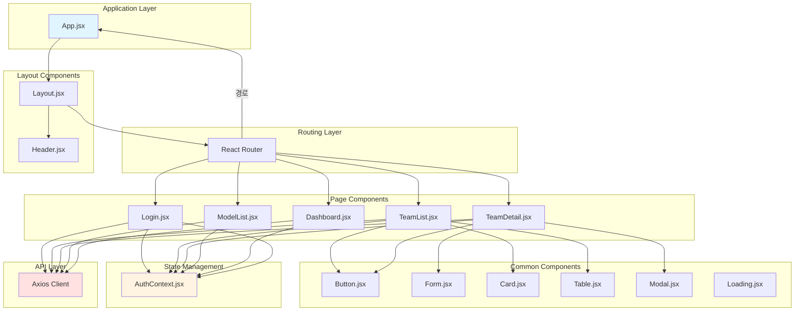

# 프론트엔드 모듈 아키텍처

## 1. 개요

### 1.1 프론트엔드 시스템 개요

- **담당자:** 프론트엔드 개발자 (1명)
- **개발 기간:** 5일 (0.5 M/M)
- **아키텍처 패턴:** Component-Based Architecture
- **상태 관리:** React Context API
- **Mock API:** json-server

### 1.2 아키텍처 원칙

- **컴포넌트 재사용성:** 공통 컴포넌트 중심 설계
- **단일 책임 원칙:** 각 컴포넌트가 하나의 역할만 수행
- **선언적 UI:** React의 선언적 스타일 활용
- **모듈화:** 기능별 명확한 분리

---

## 2. 컴포넌트 아키텍처



---

## 3. 디렉토리 구조

### 3.1 전체 디렉토리 구조

```
src/
├── components/          # 컴포넌트
│   ├── common/         # 공통 컴포넌트
│   ├── layout/         # 레이아웃 컴포넌트
│   └── pages/         # 페이지 컴포넌트
├── context/           # 상태 관리 (React Context)
├── services/          # API 서비스
├── hooks/             # 커스텀 Hooks
├── styles/            # 스타일 파일
├── mock/              # Mock 데이터
├── utils/             # 유틸리티 함수
├── App.jsx            # 앱 루트 컴포넌트
├── main.jsx           # 엔트리 포인트
└── index.css          # 글로벌 스타일
```

### 3.2 상세 디렉토리 구조

```
src/
├── components/
│   ├── common/
│   │   ├── Button.jsx
│   │   ├── Input.jsx
│   │   ├── Select.jsx
│   │   ├── Form.jsx
│   │   ├── Card.jsx
│   │   ├── Table.jsx
│   │   ├── Modal.jsx
│   │   ├── Notification.jsx
│   │   └── Loading.jsx
│   ├── layout/
│   │   ├── Header.jsx
│   │   ├── Sidebar.jsx
│   │   ├── Footer.jsx
│   │   └── Layout.jsx
│   └── pages/
│       ├── Login.jsx
│       ├── TeamList.jsx
│       ├── TeamCreate.jsx
│       ├── TeamDetail.jsx
│       ├── TeamMemberManage.jsx
│       ├── ModelList.jsx
│       ├── ModelCreate.jsx
│       ├── ModelDetail.jsx
│       ├── QuotaSettings.jsx
│       └── Dashboard.jsx
├── context/
│   ├── AuthContext.jsx
│   └── ThemeContext.jsx
├── services/
│   ├── api.js
│   ├── authService.js
│   ├── teamService.js
│   ├── modelService.js
│   └── dashboardService.js
├── hooks/
│   ├── useAuth.js
│   ├── useTeams.js
│   ├── useModels.js
│   └── useDashboard.js
├── styles/
│   ├── reset.css
│   ├── variables.css
│   ├── global.css
│   └── components.css
├── mock/
│   ├── users.json
│   ├── teams.json
│   ├── teamMembers.json
│   ├── models.json
│   ├── usage.json
│   └── dashboard.json
└── utils/
    ├── apiClient.js
    ├── format.js
    └── validation.js
```

---

## 4. 공통 컴포넌트 (Common Components)

### 4.1 Button 컴포넌트

**역할:** 재사용 가능한 버튼 컴포넌트

```jsx
import React from 'react';
import PropTypes from 'prop-types';

const Button = ({ 
  children, 
  variant = 'primary', 
  size = 'medium', 
  disabled = false, 
  onClick,
  type = 'button',
  className = '' 
}) => {
  const baseStyles = 'font-medium rounded-lg transition-colors';
  
  const variants = {
    primary: 'bg-blue-600 text-white hover:bg-blue-700',
    secondary: 'bg-gray-200 text-gray-800 hover:bg-gray-300',
    danger: 'bg-red-600 text-white hover:bg-red-700',
    outline: 'border-2 border-blue-600 text-blue-600 hover:bg-blue-50'
  };
  
  const sizes = {
    small: 'px-3 py-1.5 text-sm',
    medium: 'px-4 py-2 text-base',
    large: 'px-6 py-3 text-lg'
  };
  
  return (
    <button
      type={type}
      disabled={disabled}
      onClick={onClick}
      className={`${baseStyles} ${variants[variant]} ${sizes[size]} ${disabled ? 'opacity-50 cursor-not-allowed' : ''} ${className}`}
    >
      {children}
    </button>
  );
};

Button.propTypes = {
  children: PropTypes.node.isRequired,
  variant: PropTypes.oneOf(['primary', 'secondary', 'danger', 'outline']),
  size: PropTypes.oneOf(['small', 'medium', 'large']),
  disabled: PropTypes.bool,
  onClick: PropTypes.func,
  type: PropTypes.oneOf(['button', 'submit', 'reset']),
  className: PropTypes.string
};

export default Button;
```

### 4.2 Form 컴포넌트

**역할:** 폼 입력 요소를 포함한 재사용 가능한 폼 컴포넌트

```jsx
import React, { useState } from 'react';
import PropTypes from 'prop-types';

const Form = ({ 
  children, 
  onSubmit, 
  initialValues = {},
  validationRules = {} 
}) => {
  const [values, setValues] = useState(initialValues);
  const [errors, setErrors] = useState({});

  const handleChange = (name, value) => {
    setValues(prev => ({ ...prev, [name]: value }));
    if (errors[name]) {
      setErrors(prev => ({ ...prev, [name]: '' }));
    }
  };

  const handleSubmit = (e) => {
    e.preventDefault();
    
    const newErrors = {};
    Object.keys(validationRules).forEach(field => {
      const error = validationRules[field](values[field]);
      if (error) {
        newErrors[field] = error;
      }
    });

    if (Object.keys(newErrors).length === 0) {
      onSubmit(values);
    } else {
      setErrors(newErrors);
    }
  };

  return (
    <form onSubmit={handleSubmit}>
      {React.Children.map(children, child => {
        if (React.isValidElement(child)) {
          return React.cloneElement(child, {
            value: values[child.props.name] || '',
            onChange: handleChange,
            error: errors[child.props.name]
          });
        }
        return child;
      })}
    </form>
  );
};

Form.propTypes = {
  children: PropTypes.node.isRequired,
  onSubmit: PropTypes.func.isRequired,
  initialValues: PropTypes.object,
  validationRules: PropTypes.object
};

export default Form;
```

### 4.3 Card 컴포넌트

**역할:** 콘텐츠를 감싸는 카드 형태 컨테이너

```jsx
import React from 'react';
import PropTypes from 'prop-types';

const Card = ({ 
  children, 
  title, 
  actions, 
  className = '' 
}) => {
  return (
    <div className={`bg-white rounded-lg shadow-md p-6 ${className}`}>
      {(title || actions) && (
        <div className="flex justify-between items-center mb-4">
          {title && <h3 className="text-lg font-semibold">{title}</h3>}
          {actions && <div className="flex gap-2">{actions}</div>}
        </div>
      )}
      {children}
    </div>
  );
};

Card.propTypes = {
  children: PropTypes.node.isRequired,
  title: PropTypes.string,
  actions: PropTypes.node,
  className: PropTypes.string
};

export default Card;
```

### 4.4 Table 컴포넌트

**역할:** 데이터 테이블 표시

```jsx
import React from 'react';
import PropTypes from 'prop-types';

const Table = ({ 
  columns, 
  data, 
  onRowClick,
  loading = false,
  emptyMessage = '데이터가 없습니다.' 
}) => {
  if (loading) {
    return <div className="text-center py-8">로딩 중...</div>;
  }

  if (!data || data.length === 0) {
    return <div className="text-center py-8 text-gray-500">{emptyMessage}</div>;
  }

  return (
    <div className="overflow-x-auto">
      <table className="min-w-full divide-y divide-gray-200">
        <thead className="bg-gray-50">
          <tr>
            {columns.map((column, index) => (
              <th
                key={index}
                className="px-6 py-3 text-left text-xs font-medium text-gray-500 uppercase tracking-wider"
              >
                {column.header}
              </th>
            ))}
          </tr>
        </thead>
        <tbody className="bg-white divide-y divide-gray-200">
          {data.map((row, rowIndex) => (
            <tr
              key={rowIndex}
              onClick={() => onRowClick?.(row)}
              className={onRowClick ? 'cursor-pointer hover:bg-gray-50' : ''}
            >
              {columns.map((column, colIndex) => (
                <td
                  key={colIndex}
                  className="px-6 py-4 whitespace-nowrap text-sm text-gray-900"
                >
                  {column.render ? column.render(row[column.key], row) : row[column.key]}
                </td>
              ))}
            </tr>
          ))}
        </tbody>
      </table>
    </div>
  );
};

Table.propTypes = {
  columns: PropTypes.arrayOf(
    PropTypes.shape({
      header: PropTypes.string.isRequired,
      key: PropTypes.string.isRequired,
      render: PropTypes.func
    })
  ).isRequired,
  data: PropTypes.array.isRequired,
  onRowClick: PropTypes.func,
  loading: PropTypes.bool,
  emptyMessage: PropTypes.string
};

export default Table;
```

### 4.5 Modal 컴포넌트

**역할:** 모달 다이얼로그 표시

```jsx
import React, { useEffect } from 'react';
import PropTypes from 'prop-types';

const Modal = ({ 
  isOpen, 
  onClose, 
  title, 
  children,
  size = 'medium'
}) => {
  useEffect(() => {
    if (isOpen) {
      document.body.style.overflow = 'hidden';
    } else {
      document.body.style.overflow = 'unset';
    }
    return () => {
      document.body.style.overflow = 'unset';
    };
  }, [isOpen]);

  if (!isOpen) return null;

  const sizes = {
    small: 'max-w-md',
    medium: 'max-w-lg',
    large: 'max-w-2xl'
  };

  return (
    <div className="fixed inset-0 z-50 overflow-y-auto">
      <div className="flex min-h-screen items-center justify-center p-4">
        {/* Overlay */}
        <div
          className="fixed inset-0 bg-black bg-opacity-50 transition-opacity"
          onClick={onClose}
        />
        
        {/* Modal */}
        <div className={`relative bg-white rounded-lg shadow-xl ${sizes[size]} w-full`}>
          {/* Header */}
          <div className="flex justify-between items-center p-4 border-b">
            <h3 className="text-lg font-semibold">{title}</h3>
            <button
              onClick={onClose}
              className="text-gray-400 hover:text-gray-600"
            >
              <svg className="w-6 h-6" fill="none" viewBox="0 0 24 24" stroke="currentColor">
                <path strokeLinecap="round" strokeLinejoin="round" strokeWidth={2} d="M6 18L18 6M6 6l12 12" />
              </svg>
            </button>
          </div>
          
          {/* Body */}
          <div className="p-4">
            {children}
          </div>
        </div>
      </div>
    </div>
  );
};

Modal.propTypes = {
  isOpen: PropTypes.bool.isRequired,
  onClose: PropTypes.func.isRequired,
  title: PropTypes.string,
  children: PropTypes.node.isRequired,
  size: PropTypes.oneOf(['small', 'medium', 'large'])
};

export default Modal;
```

### 4.6 Loading 컴포넌트

**역할:** 로딩 상태 표시

```jsx
import React from 'react';

const Loading = ({ 
  size = 'medium', 
  text = '로딩 중...' 
}) => {
  const sizes = {
    small: 'w-4 h-4',
    medium: 'w-8 h-8',
    large: 'w-12 h-12'
  };

  return (
    <div className="flex flex-col items-center justify-center space-y-2">
      <div className={`animate-spin rounded-full border-4 border-gray-200 border-t-blue-600 ${sizes[size]}`} />
      {text && <p className="text-gray-600 text-sm">{text}</p>}
    </div>
  );
};

export default Loading;
```

---

## 5. 페이지 컴포넌트 (Page Components)

### 5.1 Login 페이지

**역할:** 사용자 로그인 화면

```jsx
import React, { useContext } from 'react';
import { useNavigate } from 'react-router-dom';
import { AuthContext } from '../context/AuthContext';
import Button from '../components/common/Button';
import Input from '../components/common/Input';
import Card from '../components/common/Card';

const Login = () => {
  const { login } = useContext(AuthContext);
  const navigate = useNavigate();
  const [formData, setFormData] = useState({ username: '', password: '' });
  const [error, setError] = useState('');

  const handleSubmit = async (e) => {
    e.preventDefault();
    try {
      await login(formData);
      navigate('/dashboard');
    } catch (err) {
      setError('로그인에 실패했습니다.');
    }
  };

  return (
    <div className="min-h-screen flex items-center justify-center bg-gray-100">
      <Card title="로그인" className="w-full max-w-md">
        <form onSubmit={handleSubmit} className="space-y-4">
          <Input
            label="사용자명"
            type="text"
            value={formData.username}
            onChange={(name, value) => setFormData({ ...formData, [name]: value })}
            name="username"
            required
          />
          <Input
            label="비밀번호"
            type="password"
            value={formData.password}
            onChange={(name, value) => setFormData({ ...formData, [name]: value })}
            name="password"
            required
          />
          {error && <p className="text-red-600 text-sm">{error}</p>}
          <Button type="submit" className="w-full">
            로그인
          </Button>
        </form>
      </Card>
    </div>
  );
};

export default Login;
```

### 5.2 TeamList 페이지

**역할:** 팀 목록 표시

```jsx
import React, { useEffect, useState } from 'react';
import { useNavigate } from 'react-router-dom';
import { useAuth } from '../hooks/useAuth';
import { teamService } from '../services/teamService';
import Table from '../components/common/Table';
import Button from '../components/common/Button';
import Card from '../components/common/Card';
import Loading from '../components/common/Loading';

const TeamList = () => {
  const { user } = useAuth();
  const navigate = useNavigate();
  const [teams, setTeams] = useState([]);
  const [loading, setLoading] = useState(true);

  useEffect(() => {
    loadTeams();
  }, []);

  const loadTeams = async () => {
    try {
      const data = await teamService.getAllTeams();
      setTeams(data);
    } catch (error) {
      console.error('팀 목록 로드 실패:', error);
    } finally {
      setLoading(false);
    }
  };

  const columns = [
    { header: 'ID', key: 'id' },
    { header: '팀 이름', key: 'name' },
    { 
      header: '할당량', 
      key: 'quota',
      render: (value) => `${value.toLocaleString()} 토큰`
    },
    { 
      header: '사용량', 
      key: 'usage',
      render: (value) => `${value.toLocaleString()} 토큰`
    },
    {
      header: '사용률',
      key: 'usageRate',
      render: (value, row) => {
        const rate = ((row.usage / row.quota) * 100).toFixed(1);
        const color = rate > 80 ? 'text-red-600' : 'text-green-600';
        return <span className={color}>{rate}%</span>;
      }
    }
  ];

  if (loading) {
    return <Loading />;
  }

  return (
    <div className="container mx-auto px-4 py-8">
      <Card 
        title="팀 목록"
        actions={
          <Button onClick={() => navigate('/teams/create')}>
            팀 생성
          </Button>
        }
      >
        <Table 
          columns={columns} 
          data={teams}
          onRowClick={(team) => navigate(`/teams/${team.id}`)}
        />
      </Card>
    </div>
  );
};

export default TeamList;
```

### 5.3 Dashboard 페이지

**역할:** 종합 대시보드

```jsx
import React, { useEffect, useState } from 'react';
import { useAuth } from '../hooks/useAuth';
import { dashboardService } from '../services/dashboardService';
import Card from '../components/common/Card';
import Loading from '../components/common/Loading';

const Dashboard = () => {
  const { user } = useAuth();
  const [dashboardData, setDashboardData] = useState(null);
  const [loading, setLoading] = useState(true);

  useEffect(() => {
    loadDashboardData();
  }, []);

  const loadDashboardData = async () => {
    try {
      const data = await dashboardService.getDashboardData();
      setDashboardData(data);
    } catch (error) {
      console.error('대시보드 데이터 로드 실패:', error);
    } finally {
      setLoading(false);
    }
  };

  if (loading) {
    return <Loading />;
  }

  return (
    <div className="container mx-auto px-4 py-8">
      <h1 className="text-3xl font-bold mb-8">대시보드</h1>
      
      <div className="grid grid-cols-1 md:grid-cols-2 lg:grid-cols-4 gap-6 mb-8">
        <Card>
          <div className="text-sm text-gray-600 mb-2">총 사용량</div>
          <div className="text-2xl font-bold">
            {dashboardData?.totalUsage?.toLocaleString()} 토큰
          </div>
        </Card>
        
        <Card>
          <div className="text-sm text-gray-600 mb-2">활성 사용자</div>
          <div className="text-2xl font-bold">
            {dashboardData?.activeUsers}
          </div>
        </Card>
        
        <Card>
          <div className="text-sm text-gray-600 mb-2">팀 수</div>
          <div className="text-2xl font-bold">
            {dashboardData?.teams}
          </div>
        </Card>
        
        <Card>
          <div className="text-sm text-gray-600 mb-2">모델 수</div>
          <div className="text-2xl font-bold">
            {dashboardData?.models}
          </div>
        </Card>
      </div>
      
      {/* 차트 영역 */}
      <div className="grid grid-cols-1 lg:grid-cols-2 gap-6">
        <Card title="팀별 사용량">
          {/* 차트 컴포넌트 */}
        </Card>
        
        <Card title="모델별 사용량">
          {/* 차트 컴포넌트 */}
        </Card>
      </div>
    </div>
  );
};

export default Dashboard;
```

---

## 6. 상태 관리 (State Management)

### 6.1 AuthContext

**역할:** 인증 상태 관리

```jsx
import React, { createContext, useContext, useState, useEffect } from 'react';
import { authService } from '../services/authService';

const AuthContext = createContext();

export const useAuth = () => {
  const context = useContext(AuthContext);
  if (!context) {
    throw new Error('useAuth must be used within AuthProvider');
  }
  return context;
};

export const AuthProvider = ({ children }) => {
  const [user, setUser] = useState(null);
  const [loading, setLoading] = useState(true);
  const [token, setToken] = useState(localStorage.getItem('token'));

  useEffect(() => {
    const checkAuth = async () => {
      const storedToken = localStorage.getItem('token');
      if (storedToken) {
        try {
          const userData = await authService.getMe();
          setUser(userData);
          setToken(storedToken);
        } catch (error) {
          localStorage.removeItem('token');
          setToken(null);
        }
      }
      setLoading(false);
    };

    checkAuth();
  }, []);

  const login = async (credentials) => {
    const response = await authService.login(credentials);
    localStorage.setItem('token', response.token);
    setUser(response.user);
    setToken(response.token);
    return response;
  };

  const logout = () => {
    localStorage.removeItem('token');
    setUser(null);
    setToken(null);
  };

  const value = {
    user,
    token,
    loading,
    login,
    logout,
    isAuthenticated: !!user
  };

  return (
    <AuthContext.Provider value={value}>
      {children}
    </AuthContext.Provider>
  );
};
```

---

## 7. 라우팅 (Routing)

### 7.1 라우트 설정

```jsx
import React from 'react';
import { BrowserRouter, Routes, Route, Navigate } from 'react-router-dom';
import { AuthProvider, useAuth } from './context/AuthContext';
import Login from './components/pages/Login';
import TeamList from './components/pages/TeamList';
import TeamCreate from './components/pages/TeamCreate';
import TeamDetail from './components/pages/TeamDetail';
import ModelList from './components/pages/ModelList';
import Dashboard from './components/pages/Dashboard';

const ProtectedRoute = ({ children }) => {
  const { isAuthenticated, loading } = useAuth();
  
  if (loading) {
    return <div>로딩 중...</div>;
  }
  
  return isAuthenticated ? children : <Navigate to="/login" />;
};

const AppRoutes = () => {
  return (
    <BrowserRouter>
      <AuthProvider>
        <Routes>
          <Route path="/login" element={<Login />} />
          <Route path="/" element={<Navigate to="/dashboard" />} />
          <Route
            path="/dashboard"
            element={
              <ProtectedRoute>
                <Dashboard />
              </ProtectedRoute>
            }
          />
          <Route
            path="/teams"
            element={
              <ProtectedRoute>
                <TeamList />
              </ProtectedRoute>
            }
          />
          <Route
            path="/teams/create"
            element={
              <ProtectedRoute>
                <TeamCreate />
              </ProtectedRoute>
            }
          />
          <Route
            path="/teams/:id"
            element={
              <ProtectedRoute>
                <TeamDetail />
              </ProtectedRoute>
            }
          />
          <Route
            path="/models"
            element={
              <ProtectedRoute>
                <ModelList />
              </ProtectedRoute>
            }
          />
        </Routes>
      </AuthProvider>
    </BrowserRouter>
  );
};

export default AppRoutes;
```

---

## 8. API 서비스 (API Services)

### 8.1 API 클라이언트 설정

```jsx
// utils/apiClient.js
import axios from 'axios';

const apiClient = axios.create({
  baseURL: import.meta.env.VITE_API_BASE_URL || 'http://localhost:3000',
  timeout: 10000,
  headers: {
    'Content-Type': 'application/json',
  },
});

// 요청 인터셉터
apiClient.interceptors.request.use(
  (config) => {
    const token = localStorage.getItem('token');
    if (token) {
      config.headers.Authorization = `Bearer ${token}`;
    }
    return config;
  },
  (error) => {
    return Promise.reject(error);
  }
);

// 응답 인터셉터
apiClient.interceptors.response.use(
  (response) => response.data,
  (error) => {
    if (error.response?.status === 401) {
      localStorage.removeItem('token');
      window.location.href = '/login';
    }
    return Promise.reject(error);
  }
);

export default apiClient;
```

### 8.2 서비스 예시

```jsx
// services/teamService.js
import apiClient from '../utils/apiClient';

export const teamService = {
  getAllTeams: async () => {
    return apiClient.get('/teams');
  },

  getTeamById: async (id) => {
    return apiClient.get(`/teams/${id}`);
  },

  createTeam: async (data) => {
    return apiClient.post('/teams', data);
  },

  updateTeam: async (id, data) => {
    return apiClient.put(`/teams/${id}`, data);
  },

  deleteTeam: async (id) => {
    return apiClient.delete(`/teams/${id}`);
  }
};
```

---

## 9. Mock 데이터 (Mock Data)

### 9.1 json-server 설정

```json
{
  "port": 3000,
  "watch": true,
  "routes": "mock/routes.json",
  "static": "mock/public",
  "readOnly": false,
  "noCors": false
}
```

### 9.2 Mock 데이터 예시

```json
{
  "teams": [
    {
      "id": 1,
      "name": "팀 A",
      "quota": 1000000,
      "usage": 500000,
      "createdAt": "2026-01-01T00:00:00Z",
      "updatedAt": "2026-01-08T00:00:00Z"
    },
    {
      "id": 2,
      "name": "팀 B",
      "quota": 800000,
      "usage": 400000,
      "createdAt": "2026-01-01T00:00:00Z",
      "updatedAt": "2026-01-08T00:00:00Z"
    }
  ],
  "models": [
    {
      "id": 1,
      "name": "GPT-4",
      "provider": "OpenAI",
      "costPerToken": 0.00003,
      "apiKey": "sk-mock-key-1",
      "isActive": true,
      "createdAt": "2026-01-01T00:00:00Z",
      "updatedAt": "2026-01-08T00:00:00Z"
    },
    {
      "id": 2,
      "name": "Claude-3",
      "provider": "Anthropic",
      "costPerToken": 0.000025,
      "apiKey": "sk-mock-key-2",
      "isActive": true,
      "createdAt": "2026-01-01T00:00:00Z",
      "updatedAt": "2026-01-08T00:00:00Z"
    }
  ],
  "dashboard": {
    "totalUsage": 900000,
    "activeUsers": 5,
    "teams": 2,
    "models": 2
  }
}
```

---

## 10. 스타일링 (Styling)

### 10.1 CSS Reset

```css
/* styles/reset.css */
* {
  margin: 0;
  padding: 0;
  box-sizing: border-box;
}

body {
  font-family: -apple-system, BlinkMacSystemFont, 'Segoe UI', 'Roboto', 'Oxygen',
    'Ubuntu', 'Cantarell', 'Fira Sans', 'Droid Sans', 'Helvetica Neue',
    sans-serif;
  -webkit-font-smoothing: antialiased;
  -moz-osx-font-smoothing: grayscale;
}

html, body {
  height: 100%;
}
```

### 10.2 CSS Variables

```css
/* styles/variables.css */
:root {
  --primary-color: #2563eb;
  --primary-hover: #1d4ed8;
  --secondary-color: #6b7280;
  --danger-color: #dc2626;
  --success-color: #16a34a;
  --warning-color: #f59e0b;
  
  --text-primary: #1f2937;
  --text-secondary: #6b7280;
  
  --bg-primary: #ffffff;
  --bg-secondary: #f9fafb;
  --bg-tertiary: #f3f4f6;
  
  --border-color: #e5e7eb;
  
  --shadow-sm: 0 1px 2px 0 rgba(0, 0, 0, 0.05);
  --shadow-md: 0 4px 6px -1px rgba(0, 0, 0, 0.1);
  --shadow-lg: 0 10px 15px -3px rgba(0, 0, 0, 0.1);
}
```

---

## 11. MVP 제한사항

### 11.1 기능적 제한

- 실제 백엔드 API 연동 없음 (Mock 데이터만 활용)
- 복잡한 상태 관리 제외 (Context API만 사용)
- 반응형 웹 기본 구현만
- 다국어 지원 제외 (한국어만)
- 고급 UI/UX 제외 (애니메이션 최소화)

### 11.2 기술적 제한

- Redux/Zustand 미사용 (Context API만)
- TypeScript 선택사항
- Tailwind CSS 선택사항
- 고급 차트 라이브러리 제외

---

## 12. 향후 확장 계획

### 12.1 상태 관리

- Redux Toolkit 도입 고려
- React Query for Server State
- Zustand for Client State

### 12.2 UI/UX

- Tailwind CSS 도입
- Framer Motion for 애니메이션
- React Query 데이터 캐싱

### 12.3 기능

- 실제 백엔드 API 연동
- WebSocket 실시간 업데이트
- 다국어 지원 (i18n)
- 고급 차트 및 시각화

---

*문서 작성일: 2026년 1월 8일*  
*문서 버전: 1.0*  
*작성자: 아키텍트*