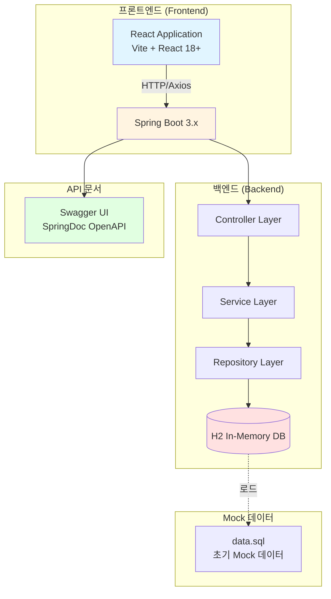
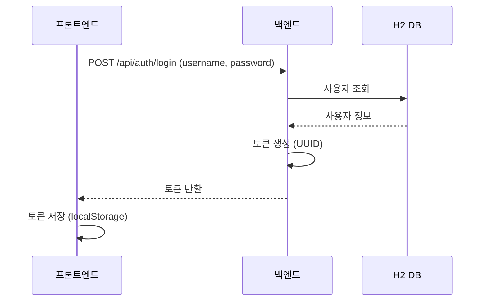
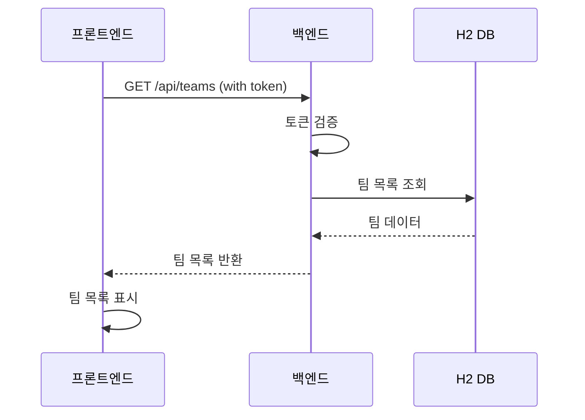

# LLM 사용량 제어 시스템 - 시스템 아키텍처 개요

## 1. 시스템 개요

### 1.1 프로젝트 개요

- **프로젝트명:** LLM 사용량 제어 시스템 (MVP)
- **개발 기간:** 2주 (1 M/M)
- **투입 인력:** 백엔드 1명 (0.5 M/M), 프론트엔드 1명 (0.5 M/M)
- **개발 방법론:** 단순화된 Waterfall (Mock 기반)

### 1.2 시스템 목표

MVP 단계에서 다음 기능을 통해 LLM 사용량 제어 시스템의 핵심 개념을 검증:

- 사용자 인증 및 권한 관리
- 팀 및 팀원 관리
- LLM 모델 등록 및 관리
- 사용량 할당량 설정 및 모니터링
- 종합 대시보드 제공

### 1.3 MVP 제약 조건

- **데이터베이스:** 실제 DB 연동 없이 H2 In-Memory DB 사용
- **API 연동:** 실제 LLM API 연동 없이 Mock 데이터 활용
- **아키텍처:** 단일 Monolithic 구조 (마이크로서비스 제외)
- **보안:** HTTPS, 암호화, MFA 제외
- **DevOps:** CI/CD, Docker, K8s 제외
- **테스트:** 기본 단위 테스트만 수행

---

## 2. 시스템 아키텍처 다이어그램



---

## 3. 시스템 구성

### 3.1 백엔드 시스템 구조

```
백엔드 서버 (Spring Boot 3.x)
├── Controller Layer (API 엔드포인트)
│   ├── AuthController - 인증/인가
│   ├── TeamController - 팀 관리
│   ├── TeamMemberController - 팀원 관리
│   ├── ModelController - LLM 모델 관리
│   └── DashboardController - 대시보드 데이터
├── Service Layer (비즈니스 로직)
│   ├── AuthService
│   ├── TeamService
│   ├── ModelService
│   └── DashboardService
├── Repository Layer (데이터 접근)
│   ├── UserRepository
│   ├── TeamRepository
│   ├── TeamMemberRepository
│   ├── ModelRepository
│   └── UsageRepository
├── Entity Layer (데이터 모델)
│   ├── User
│   ├── Team
│   ├── TeamMember
│   ├── LLMModel
│   └── Usage
├── Config Layer (설정)
│   ├── SwaggerConfig
│   └── SecurityConfig (Mock)
└── H2 In-Memory DB (데이터베이스)
```

### 3.2 프론트엔드 시스템 구조

```
프론트엔드 애플리케이션 (React 18+)
├── Components Layer
│   ├── Common Components (공통 컴포넌트)
│   │   ├── Button
│   │   ├── Form
│   │   ├── Card
│   │   ├── Table
│   │   ├── Notification
│   │   ├── Modal
│   │   └── Loading
│   ├── Layout Components (레이아웃)
│   │   ├── Header
│   │   └── Layout
│   └── Page Components (페이지)
│       ├── Login
│       ├── TeamList
│       ├── TeamDetail
│       ├── TeamCreate
│       ├── ModelList
│       ├── ModelDetail
│       ├── ModelCreate
│       ├── QuotaSettings
│       └── Dashboard
├── State Management (상태 관리)
│   └── AuthContext
├── Routing (라우팅)
│   └── React Router 6+
├── API Layer (API 통신)
│   └── Axios Client
└── Mock Data (Mock 데이터)
    ├── json-server
    └── Mock JSON Files
```

---

## 4. 주요 기능 모듈

### 4.1 인증 모듈 (Authentication)

- **기능:** 사용자 로그인, 토큰 발급 및 검증
- **구현:** Mock 기반 (하드코딩된 사용자 정보)
- **제외:** OAuth2.0, MFA

### 4.2 팀 관리 모듈 (Team Management)

- **기능:** 팀 CRUD, 팀원 관리, 할당량 설정
- **구현:** H2 In-Memory DB 저장
- **제외:** 복잡한 비즈니스 로직

### 4.3 LLM 모델 관리 모듈 (Model Management)

- **기능:** 모델 등록, 조회, 수정, 삭제, 활성/비활성
- **구현:** Mock 데이터 기반
- **제외:** 실제 LLM API 연동

### 4.4 사용량 제어 모듈 (Usage Control)

- **기능:** 할당량 설정, 사용량 모니터링
- **구현:** Mock 데이터 반환
- **제외:** 실시간 모니터링, WebSocket

### 4.5 대시보드 모듈 (Dashboard)

- **기능:** 종합 대시보드, 기본 통계
- **구현:** Mock 데이터 기반 차트
- **제외:** 고급 차트, 실시간 업데이트

---

## 5. 데이터 흐름

### 5.1 사용자 로그인 흐름



### 5.2 팀 목록 조회 흐름



---

## 6. 기술 스택

### 6.1 백엔드 기술 스택

| 카테고리 | 기술 | 용도 |
|---------|------|------|
| 언어 | Java 17 or 21 | 개발 언어 |
| 프레임워크 | Spring Boot 3.x | 웹 프레임워크 |
| 빌드 도구 | Gradle | 빌드 및 의존성 관리 |
| 데이터베이스 | H2 (In-Memory) | 데이터 저장소 |
| API 문서 | SpringDoc OpenAPI (Swagger) | API 명세서 |
| 테스트 | JUnit 5 | 단위 테스트 |

### 6.2 프론트엔드 기술 스택

| 카테고리 | 기술 | 용도 |
|---------|------|------|
| 언어 | JavaScript (ES6+) / TypeScript | 개발 언어 |
| 프레임워크 | React 18+ | UI 프레임워크 |
| 빌드 도구 | Vite | 빌드 및 개발 서버 |
| 라우팅 | React Router 6+ | 라우팅 |
| 상태 관리 | React Context API | 상태 관리 |
| 스타일 | CSS / Tailwind CSS | 스타일링 |
| HTTP 클라이언트 | Axios | API 통신 |
| Mock API | json-server | Mock 서버 |
| 차트 라이브러리 | Chart.js 또는 Recharts | 차트 표현 |

---

## 7. 보안 고려사항 (MVP 제한)

MVP 단계에서는 다음 보안 기능이 제외됩니다:

- HTTPS 강제 적용
- 비밀번호 암호화
- JWT 토큰 (UUID 기반 간단 토큰 사용)
- MFA (다단계 인증)
- API 키 암호화

---

## 8. 성능 고려사항 (MVP 제한)

MVP 단계에서는 다음 성능 최적화 기능이 제외됩니다:

- 캐싱
- 비동기 처리
- 메시지 큐
- 데이터베이스 인덱싱
- CDN

---

## 9. 배포 고려사항 (MVP 제한)

MVP 단계에서는 다음 배포 기능이 제외됩니다:

- CI/CD 파이프라인
- Docker 컨테이너화
- Kubernetes 오케스트레이션
- 클라우드 배포

**현재:** 로컬 개발 환경에서만 실행

---

## 10. 향후 확장 계획

MVP 이후 다음 기능들이 추가될 예정입니다:

- PostgreSQL/MySQL로 DB 전환
- 실제 OAuth2.0 인증 구현
- JWT 토큰 기반 인증
- 실제 LLM API 연동
- WebSocket 기반 실시간 모니터링
- 고급 차트 및 통계 기능
- CI/CD 파이프라인 구축
- Docker 컨테이너화

---

*문서 작성일: 2026년 1월 8일*  
*문서 버전: 1.0*  
*작성자: 아키텍트*